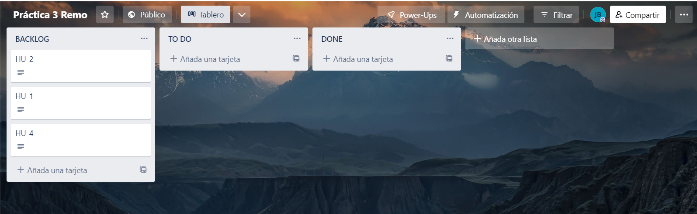
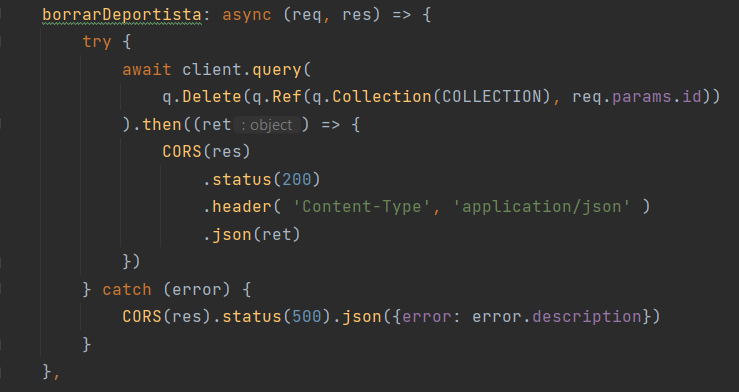
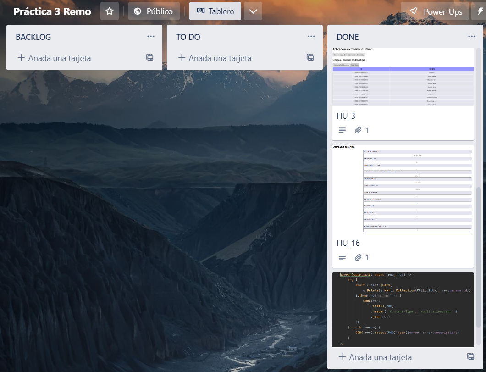

# Practica 3
## Información del alumno

* **Nombre**: José
* **Apellidos**: Carpio Blanca
* **Correo**: jcb00034@red.ujaen.es

## Enlace al tablero Trello
https://trello.com/b/QIs0WzuA/pr%C3%A1ctica-3-remo
## Capturas de pantalla sobre fauna
### Home

### Base de datos

### Colección

### Documentos
Primer documento
```
{
  nombre: "Steve Redgrave",
  edad: 60,
  campeonatosMundo: 8,
  participacionesJJOO: [1984, 1988, 1992, 1996, 2000],
  nacionalidad: [
    {
      pais: "Reino Unido",
      ciudad: "Marlow"
    }
  ],
  altura: 1.95,
  sexo: "H",
  medallasOro: 5,
  medallasPlata: 0,
  medallasBronce: 1,
  retirado: true
}
```
Segundo documento
```
{
  nombre: "Aina Cid",
  edad: 28,
  campeonatosMundo: 0,
  participacionesJJOO: [2016, 2020],
  nacionalidad: [
    {
      pais: "España",
      ciudad: "Amposta"
    }
  ],
  altura: 1.7,
  sexo: "M",
  medallasOro: 0,
  medallasPlata: 0,
  medallasBronce: 0,
  retirado: false
}
```
Tercer documento
```
{
  nombre: "Elisabeta Lipa",
  edad: 58,
  campeonatosMundo: 0,
  participacionesJJOO: [1984, 1988, 1992, 1996, 2000, 2004],
  nacionalidad: [
    {
      pais: "Rumania",
      ciudad: "Siret"
    }
  ],
  altura: 1.83,
  sexo: "H",
  medallasOro: 5,
  medallasPlata: 2,
  medallasBronce: 1,
  retirado: true
}
```
Cuarto documento
```
{
  nombre: "Jaime Canalejo",
  edad: 31,
  campeonatosMundo: 0,
  participacionesJJOO: [2020],
  nacionalidad: [
    {
      pais: "España",
      ciudad: "Sevilla"
    }
  ],
  altura: 1.95,
  sexo: "H",
  medallasOro: 0,
  medallasPlata: 0,
  medallasBronce: 0,
  retirado: false
}
```
Quinto documento
```
{
  nombre: "Virginia Diaz",
  edad: 31,
  campeonatosMundo: 0,
  participacionesJJOO: [2020],
  nacionalidad: [
    {
      pais: "España",
      ciudad: "El Astillero"
    }
  ],
  altura: 1.8,
  sexo: "M",
  medallasOro: 0,
  medallasPlata: 0,
  medallasBronce: 0,
  retirado: false
}
```
Sexto documento
```
{
  nombre: "Stefanos Duskos",
  edad: 25,
  campeonatosMundo: 0,
  participacionesJJOO: [2020],
  nacionalidad: [
    {
      pais: "Grecia",
      ciudad: "Loanina"
    }
  ],
  altura: 1.86,
  sexo: "H",
  medallasOro: 1,
  medallasPlata: 0,
  medallasBronce: 0,
  retirado: false
}
```
Séptimo documento
```
{
  nombre: "Damir Martin",
  edad: 34,
  campeonatosMundo: 2,
  participacionesJJOO: [2012, 2016, 2020],
  nacionalidad: [
    {
      pais: "Croacia",
      ciudad: "Vukovar"
    }
  ],
  altura: 1.88,
  sexo: "H",
  medallasOro: 0,
  medallasPlata: 2,
  medallasBronce: 1,
  retirado: false
}
```
Octavo documento
```
{
  nombre: "Hamish Bond",
  edad: 37,
  campeonatosMundo: 8,
  participacionesJJOO: [2012, 2016, 2020],
  nacionalidad: [
    {
      pais: "Nueva Zelanda",
      ciudad: "Dunedin"
    }
  ],
  altura: 1.7,
  sexo: "H",
  medallasOro: 3,
  medallasPlata: 0,
  medallasBronce: 0,
  retirado: true
}
```
Noveno documento
```
{
  nombre: "Lucy Stephan",
  edad: 31,
  campeonatosMundo: 2,
  participacionesJJOO: [2016, 2020],
  nacionalidad: [
    {
      pais: "Australia",
      ciudad: "Nhill"
    }
  ],
  altura: 1.74,
  sexo: "M",
  medallasOro: 1,
  medallasPlata: 0,
  medallasBronce: 0,
  retirado: false
}
```
Décimo documento
```
{
  nombre: "Hamish Bond",
  edad: 29,
  campeonatosMundo: 2,
  participacionesJJOO: [2016, 2020],
  nacionalidad: [
    {
      pais: "Francia",
      ciudad: "Lyon"
    }
  ],
  altura: 1.95,
  sexo: "H",
  medallasOro: 1,
  medallasPlata: 0,
  medallasBronce: 0,
  retirado: false
}
```

### Primer incremento
Para el primer incremento se han elegido las historias de usuario 1,2,4.

#### Tablero Trello al iniciar el incremento


#### Funcionalidades implementadas
##### HU_1

Funcionalidad implementada en el botón "Acerca De"
##### HU_2

Funcionalidad implementada en el botón "Listar Deportistas"
##### HU_4

Funcionalidad implementada en el botón "Listar Deportistas" => "Listar Datos"

#### Tablero Trello al finalizar el incremento


Como se puede apreciar, este incremento se ha podido completar según lo planificado inicialmente y sin ningún imprevisto.

### Segundo incremento
Las historias de usuario escogidas para este segundo incremento son la 3, la 16 y la 17
#### Tablero Trello al iniciar el incremento


#### Funcionalidades implementadas
##### HU_3

Funcionalidad implementada en el botón "Listar Deportistas" -> "Ordenar Alfabéticamente"
##### HU_16

Funcionalidad implementada en el botón "Crear nuevo deportista"
##### HU_17

Funcionalidad implementada en el botón "Listar Deportistas" -> "Borrar"

#### Tablero Trello al finalizar el incremento


En este incremento, al igual que en el anterior, se ha completado sin muchas incidencias.

También se ha aprovechado para distribuir y mejorar visualmente las historias de usuario del incremento anterior, mejorando la interfaz del usuario a la hora de visualizar las tablas de datos y nombres de deportistas 

### Tercer incremento
Para este último in[README.md](README.md)cremento, las historias de usuario implementadas son la 6, la 8 y 12.

#### Tablero Trello al iniciar el incremento


#### Funcionalidades implementadas
##### HU_6

Funcionalidad implementada en el botón "Listar Deportistas" -> "Mostrar"
##### HU_8

Funcionalidad implementada en el botón "Listar Deportistas" -> "Buscar"
##### HU_12

Funcionalidad implementada en el botón "Listar Deportistas" -> "Mostrar" -> "Modificar"

#### Tablero Trello al finalizar el incremento


Este último incremento, al igual que todos los anteriores, se ha completado sin muchas incidencias.